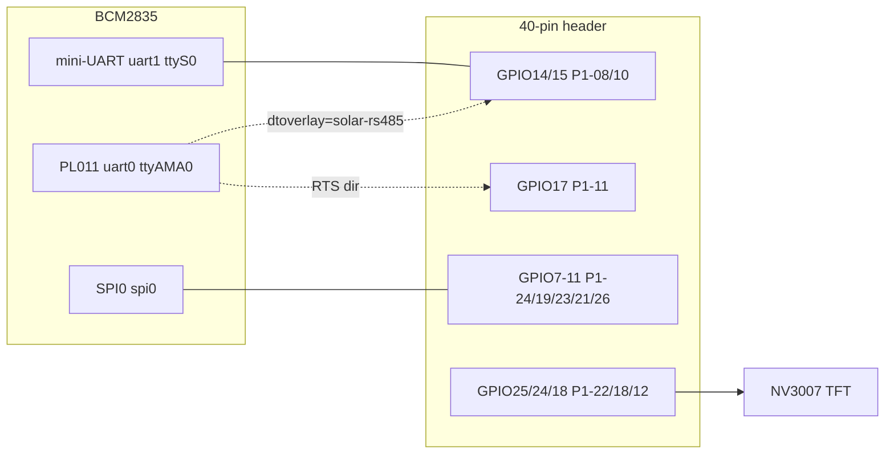

# solar-ctl firmware (fw/)

Yocto **kas** build for the **Raspberry Pi Zero W** inverter controller,
on the **wrynose** release. Standalone **openembedded-core** — *no poky* —
with a deliberately minimal image (~100 packages, ~48 MB compressed):
**musl** in stead of libc, **busybox**, **systemd**.

## CI / releases

`.github/workflows/firmware.yml` builds the image with
`kas build fw/kas-rpi0.yml:fw/kas-ci.yml` (the `kas-ci.yml` fragment only
keeps the sstate/download cache for Actions to reuse):

- **push/PR to main** — build + `solar-ctl-image-<sha>` artifact (48 MB zip
  contents: `wic.bz2`, `bmap`, `manifest`, `SHA256SUMS`)
- **tag `v*`** — same build, additionally published as a GitHub Release
- **cold** builds take well over an hour on runners; warm (cache hit)
  builds are minutes. First run is always cold.

Release flow:

```sh
git tag v0.1.0 && git push origin v0.1.0
```

**WiFi in CI:** if the repo secrets `SOLAR_WIFI_SSID`, `SOLAR_WIFI_PSK`
(and optionally `SOLAR_WIFI_COUNTRY`) are set, Actions injects them as a
throwaway kas fragment and the credentials are **baked into the built
image**. This repo is public — artifacts/releases are world-readable, so
only define these secrets for a **dedicated lab/guest SSID**, or leave
them unset (builds then keep the `CHANGEME` placeholders). Set them with:

```sh
gh secret set SOLAR_WIFI_SSID    # then type the value
gh secret set SOLAR_WIFI_PSK     # hex PSK (wpa_passphrase) or passphrase
gh secret set SOLAR_WIFI_COUNTRY # optional, e.g. DK (default GB)
```

## Layout

| Path | Purpose |
| --- | --- |
| `kas-rpi0.yml` | **Build this** — repos (pinned to wrynose), machine, WiFi creds, local.conf bits |
| `kas-baseline.yml` | Reference copy of the repo pinning (kas ≥ 5 can't auto-include fragments) |
| `conf/layer.conf` | `fw/` is a small meta layer (`solar-ctl`) |
| `conf/distro/solar-ctl.conf` | Our distro: `TCLIBC=musl`, `INIT_MANAGER=systemd`, lean distro features |
| `recipes-core/images/solar-ctl-image.bb` | Minimal image (dropbear ssh, WiFi) |
| `recipes-connectivity/solar-wifi/` | WiFi bring-up: supplicant config + systemd units |
| `recipes-core/dropbear/` | bbappend: root-only key-only SSH config |
| `recipes-core/solar-rootkeys/` | `/root/.ssh/authorized_keys` (FIDO sk-key, public half) |
| `recipes-kernel/linux/` | Kernel config slimming + nv3007/solar-rs485 DT overlays |
| `recipes-support/rs485ctl/` | RS485 RTS direction-control setup tool |

## Peripherals & wiring (40-pin header)

The Zero W's SoC has two UARTs (PL011 `uart0`, mini-UART `uart1`) and
one usable SPI (SPI0), but the header only carries **one UART data
pair (GPIO14/15, physical 8/10)** — the PL011's own default pins
(GPIO30–33) are wired to the onboard WiFi/BT chip inside the Zero W,
not to the header. Plan around that: console and native RS485 share
the same two pins and are switched in `config.txt`; SPI0 and the
remaining GPIOs are free for the display.



### Debug console (default)

| signal | GPIO | physical pin |
| --- | --- | --- |
| TXD (→ adapter RX) | GPIO14 | P1-08 |
| RXD (← adapter TX) | GPIO15 | P1-10 |
| GND | — | P1-06 |

115200 8N1, mini-UART (`ttyS0`), root auto-login on the lab image.

### NV3007 2.8" TFT (SPI0, enabled by default)

320x240 SPI display with the NV3007 controller (an ILI9341 clone —
driven by the in-kernel tinydrm `ili9341` driver via our
`nv3007` overlay, which is **on** in `config.txt`):

| display pin | GPIO | physical pin | overlay override |
| --- | --- | --- | --- |
| MOSI (SDA) | GPIO10 | P1-19 | — |
| SCLK (SCK) | GPIO11 | P1-23 | — |
| CS  | GPIO8 | P1-24 | — |
| DC  | GPIO25 | P1-22 | `dc_pin=<n>` |
| RST | GPIO24 | P1-18 | `reset_pin=<n>` |
| BLK | GPIO18 | P1-12 | `led_pin=<n>` (0 = tie to 3V3) |
| VCC | — | 3V3 (P1-01/17) | — |
| GND | — | P1-06/09/14/20/25/30/34/39 | — |

Runs at 3.3 V — do not feed 5 V into data lines unless your module
board is explicitly 5 V-tolerant. Backlight is driven from GPIO18 via
`gpio-backlight` (on at boot); wiring BLK straight to 3V3 also works —
the GPIO then just toggles a disconnected pin.

Check after boot: `dmesg | grep -iE "ili9341|tinydrm|fb0"` and a
colour-noise smoke test with `head -c 153600 /dev/urandom > /dev/fb0`
(320×240 px × 2 bytes, RGB565). Orientation: `rotation=90` (landscape)
by default; `dtoverlay=nv3007,rotate=0` changes it.

### RS485 inverter bus (ttyAMA0 / Modbus RTU)

**Now (bring-up):** use your USB-RS485 adapter on the Zero's USB port
(OTG cable) — FTDI/CH34x/CP210x/PL2303/CDC-ACM drivers and `mbpoll`
are in the image:

```sh
mbpoll -a 3 -b 9600 -t 4 -r 1 /dev/ttyUSB0     # read holding reg 1 of inv 3
```

**Native (later):** the `solar-rs485` overlay moves the PL011 onto
the header pair and uses RTS as the transceiver direction signal:

| MAX485-style transceiver | GPIO | physical pin |
| --- | --- | --- |
| DI | GPIO14 (TXD0) | P1-08 |
| RO | GPIO15 (RXD0) | P1-10 |
| DE + !RE | GPIO17 (RTS0) | P1-11 |
| A / B | bus A / bus B (+ 120 Ω termination at both ends) | — |
| VCC | 5 V from P1-02 for 5 V MAX485 boards (RO then needs a divider or level-shifted module!) | — |

Enable by uncommenting the `#dtoverlay=solar-rs485` line in
`config.txt` (on the target: `mount /dev/mmcblk0p1 /mnt &&
sed -i 's/^#dtoverlay=solar-rs485/dtoverlay=solar-rs485/'
/mnt/config.txt && reboot`), or flip it in `RPI_EXTRA_CONFIG` in
`kas-rpi0.yml` and rebuild — **this steals GPIO14/15 from the
mini-UART console** (the overlay disables it; there is no other
pin pair on this board, so you'll be working over SSH after that).
RTS idles asserted (active-low pad ⇒ LOW = driving); for DE-on-RTS
MAX485 wiring that means the driver is enabled when idle — set
`solar-rs485` + `rs485ctl /dev/ttyAMA0 -e -i` (inverted: released
while driving… experiment — see `rs485ctl -h`), and check with a
scope on RO/DE before connecting the inverter.

The kernel RS485 mode (auto-RTS per frame) is configured with
`rs485ctl` (in the image):

```sh
stty -F /dev/ttyAMA0 9600
cd /etc && rs485ctl /dev/ttyAMA0 -e -n --send-delay 1 --after-delay 1
mbpoll -a 3 -b 9600 -t 4 -r 1 /dev/ttyAMA0
```

## Requirements

- `kas` (pip or distro package; tested with 5.5), git, python3
- ~50 GB free disk; internet access (GitHub + source tarballs)
- First full build: ~20–40 min on a fast machine (subsequent: minutes)

## Build

1. Set your WiFi credentials — **keep them out of the committed yml**.
   Create `.kas-wifi-local.yml` (gitignored) next to `kas-rpi0.yml`:

   ```yaml
   header:
     version: 17
   local_conf_header:
     wifi-local: |
       SOLAR_WIFI_SSID = "my-network"
       SOLAR_WIFI_PSK = "0123...64-hex-from-wpa_passphrase"
       SOLAR_WIFI_COUNTRY = "DK"   # ISO alpha-2 regulatory domain
   ```

   Generate the hex PSK with: `wpa_passphrase "SSID" 'pass' | sed -n 's/.*psk=//p'`

2. Build from the repo root:

   ```sh
   kas build fw/kas-rpi0.yml                          # placeholder wifi
   kas build fw/kas-rpi0.yml:.kas-wifi-local.yml      # your real wifi
   ```

## Flash

The image is a hybrid `.wic.bz2` (FAT32 boot partition + ext4 rootfs):

```sh
ls build/tmp/deploy/images/raspberrypi0-wifi/solar-ctl-image-raspberrypi0-wifi.rootfs.wic.bz2

bmaptool copy \
  build/tmp/deploy/images/raspberrypi0-wifi/solar-ctl-image-raspberrypi0-wifi.rootfs.wic.bz2 \
  /dev/sdX          # the raw SD device, NOT a partition like /dev/sdX1
```

Fallback without `bmaptool`: `bzcat <image>.wic.bz2 | sudo dd of=/dev/sdX bs=4M status=progress`
(sync afterwards; no need to decompress first).

## First boot / console

- **Serial console (easy mode, dev phase)**: UART is enabled
  (`ENABLE_UART = "1"`) on the GPIO header pins 6/8/10 (GND/TXD/RXD),
  115200 8N1. `root` **auto-logs-in on the serial getty** — plug in a
  cable and you are in, no password. Lab convenience from
  `IMAGE_FEATURES += "empty-root-password serial-autologin-root"`; strip
  both before anything leaves the bench.
- **Network**: on boot, `solar-wifi.service` starts `wpa_supplicant` on
  `wlan0` and `solar-wifi-dhcp.service` requests a lease via udhcpc.
  Check with `ip addr show wlan0` (from serial).
- **SSH — root-only, key-only**: dropbear runs with `-B` (all password
  auth refused), and `/root/.ssh/authorized_keys` from the
  `solar-rootkeys` recipe holds the maintainer's FIDO security key
  (`sk-ssh-ed25519`). No other account has a key or usable password, so
  root-with-key is the only way in:

  ```sh
  ssh -i ~/.ssh/id_ed25519_sk root@<board>   # touch the security key when prompted
  ```

  Adding/removing people = adding/removing public key lines in
  `recipes-core/solar-rootkeys/solar-rootkeys/root_authorized_keys`
  (public keys only — safe to commit). Rebuild and reflash, or append
  directly to `/root/.ssh/authorized_keys` on the target for a quick
  change. Note: dropbear ≥ 2025.x verifies sk-* keys natively
  (`DROPBEAR_SK_KEYS`, on by default) — no libfido2 on the target.

## Changing WiFi later

Three options:

1. **Rebuild**: edit `SOLAR_WIFI_*` in `kas-rpi0.yml`, `kas build` again
   (fast, everything is cached except the image). Note: the PSK lives in
   the image (root-only 0600 file) — treat built images as secret.
2. **On the target** (persists across reboots, not across reflashes):
   ```sh
   wpa_passphrase "new-ssid" "new-pass" >> /etc/wpa_supplicant/wpa_supplicant-wlan0.conf
   systemctl restart solar-wifi.service solar-wifi-dhcp.service
   ```
3. **Ad-hoc** without editing files: `wpa_cli` (`add_network`, `set_network`,
   `select_network`).

## Design notes / caveats

- **No poky**: oe-core ships no distro conf, so we provide our own
  (`conf/distro/solar-ctl.conf`) with `TCLIBC=musl` and
  `INIT_MANAGER=systemd`. Busybox is OE-core's default provider — we stay
  lean by pulling only `packagegroup-core-boot` via `core-image-minimal`.
- **musl + systemd** builds cleanly here (verified end-to-end), but
  bitbake warns it is *experimental* upstream. If a future recipe needs
  glibc-only bits, expect to patch or drop it.
- **Kernel modules**: meta-raspberrypi pulls *all* ~1800 modules into every
  rpi image; our image recipe removes that and installs only the `brcmfmac`
  WiFi stack (BCM43430 firmware comes from the machine conf). Add specific
  `kernel-module-*` packages to `solar-ctl-image.bb` as needed.
- **bitbake** has no `wrynose` branch; we pin `2.18`, enforced by oe-core's
  sanity checker.
- **Licenses**: `LICENSE_FLAGS_ACCEPTED = "synaptics-killswitch"` is set for
  `linux-firmware-rpidistro`; review the BSP's `docs/ipcompliance.md`
  before shipping.
- The `solar-ctl` repo entry has no `url`, so kas builds straight from your
  working tree. Run `kas lock` for reproducible builds of the upstream pins.
